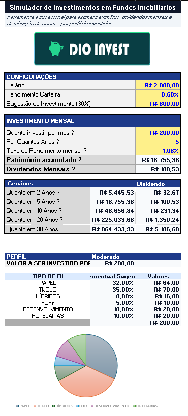
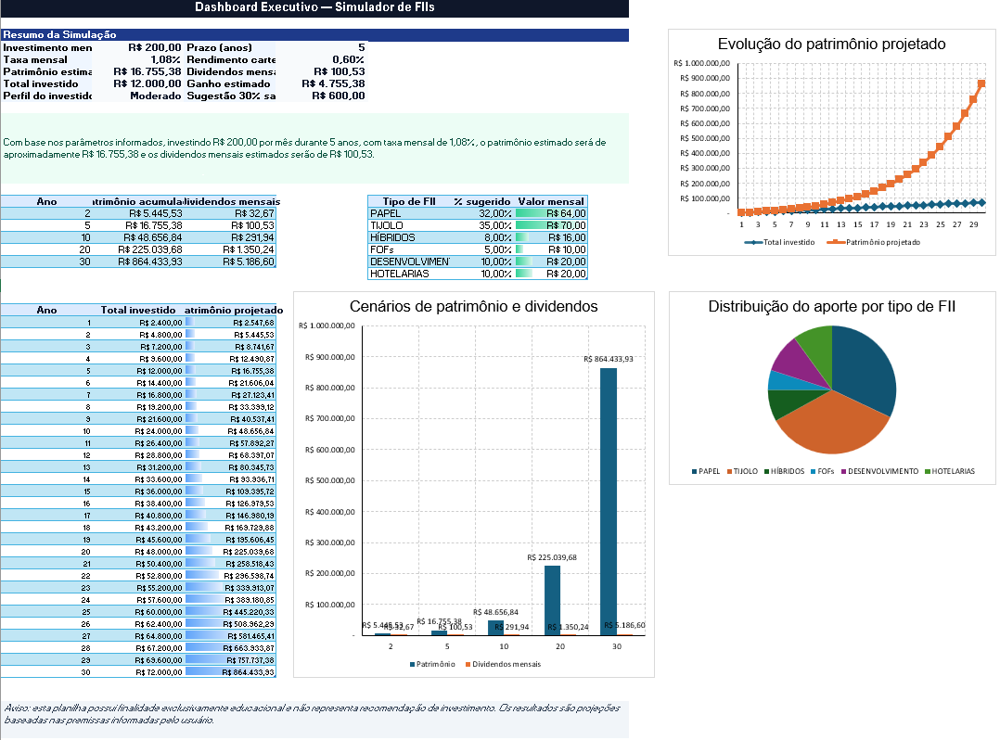

# 📈 Simulador de Investimentos em Fundos Imobiliários

Projeto desenvolvido como parte de um desafio da DIO, com o objetivo de criar uma ferramenta em Excel para simulação de investimentos em Fundos Imobiliários (FIIs).

A planilha permite estimar patrimônio acumulado, dividendos mensais, total investido e diferentes cenários de longo prazo, auxiliando o usuário a visualizar o potencial retorno de seus aportes.

## 🎯 Objetivo do Projeto

Construir uma ferramenta prática de simulação financeira utilizando Microsoft Excel, aplicando conceitos de:

* Cálculo de rendimento mensal
* Projeção de patrimônio
* Estimativa de dividendos
* Simulação de cenários
* Organização visual de informações
* Dashboard executivo

## 🧰 Tecnologias Utilizadas

* Microsoft Excel
* Fórmulas financeiras
* Gráficos
* Formatação condicional
* Dashboard
* GitHub
* Markdown

## ⚙️ Funcionalidades

* Inserção de salário e percentual sugerido para investimento
* Definição do valor mensal a ser investido
* Simulação por prazo em anos
* Cálculo de patrimônio acumulado
* Estimativa de dividendos mensais
* Comparação de cenários em 2, 5, 10, 20 e 30 anos
* Distribuição sugerida por tipo de FII
* Dashboard executivo com indicadores e gráficos
* Aba de metodologia explicando premissas e fórmulas utilizadas

## 📊 Visualização do Projeto

### Tela Principal

### Dashboard Executivo

## 📌 Principais Indicadores

A ferramenta apresenta indicadores como:

* Investimento mensal
* Taxa mensal de rendimento
* Patrimônio estimado
* Total investido
* Ganho estimado
* Dividendos mensais
* Perfil do investidor
* Distribuição do aporte por tipo de FII

## 🧠 Aprendizados

Durante o desenvolvimento deste projeto, foram praticados conceitos importantes para análise de dados e construção de soluções em Excel, como estruturação de informações, criação de cenários, visualização de dados e comunicação clara dos resultados.

Além da construção da planilha, o projeto também reforçou a importância de documentar soluções técnicas de forma organizada, utilizando o GitHub como ferramenta de portfólio.

## ⚠️ Observação

Esta planilha possui finalidade exclusivamente educacional e não representa recomendação de investimento. Os resultados são projeções baseadas nas premissas informadas pelo usuário.

## 👤 Autor

Bruno Giacomelli

[LinkedIn](https://www.linkedin.com/)
[GitHub](https://github.com/)
